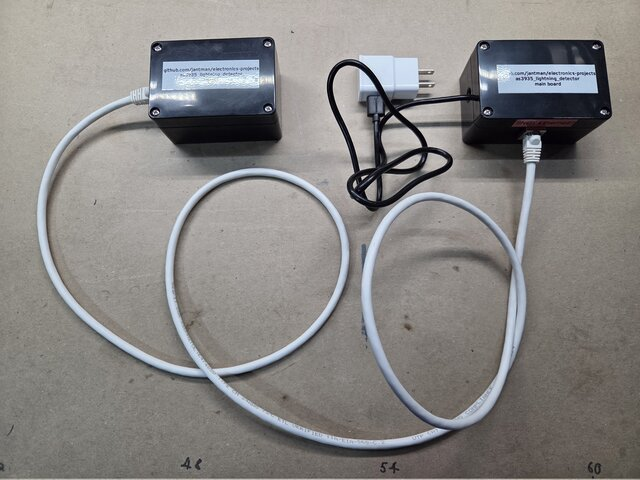
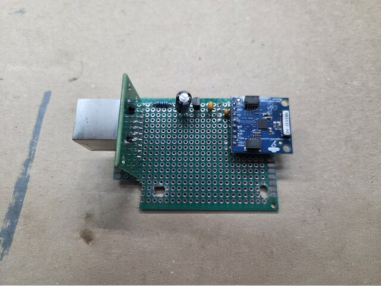
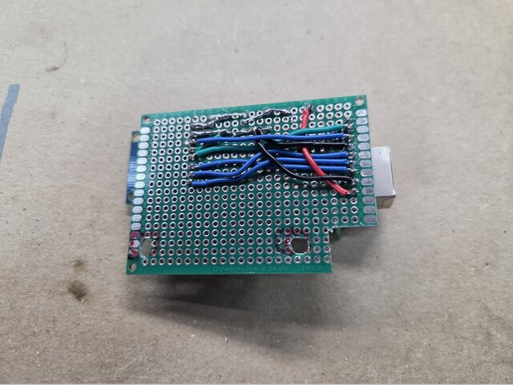
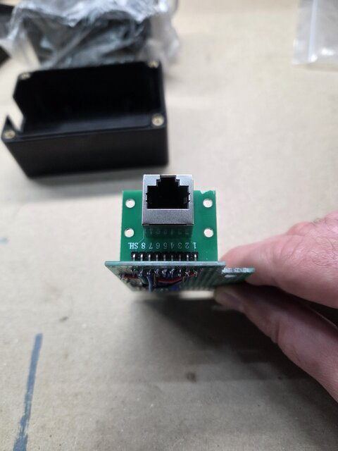
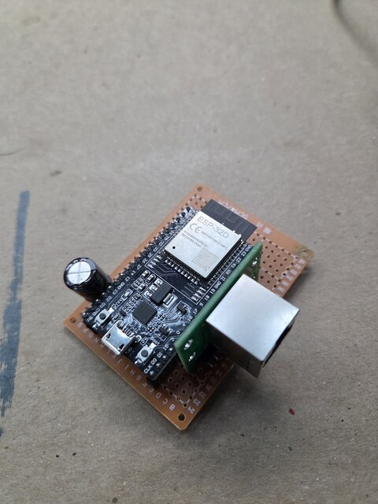
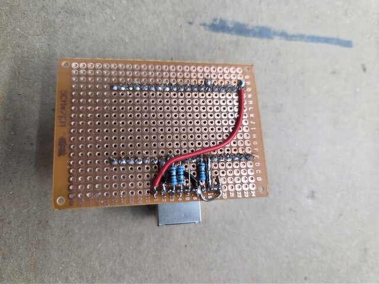
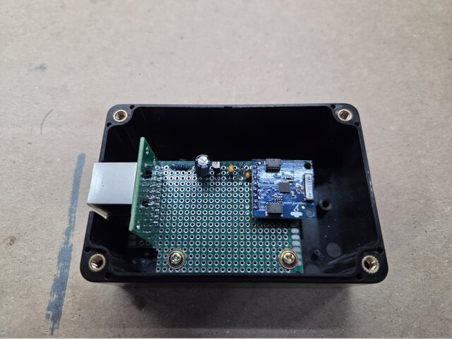
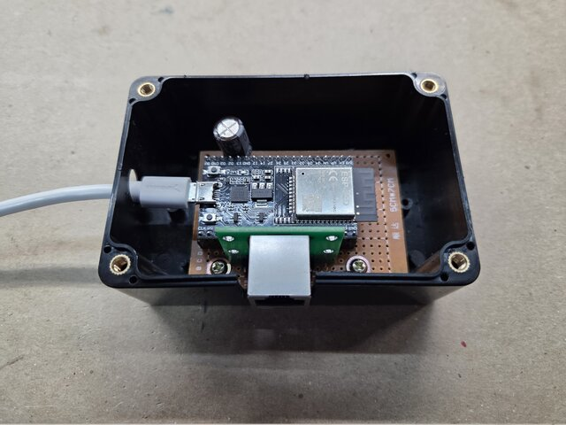
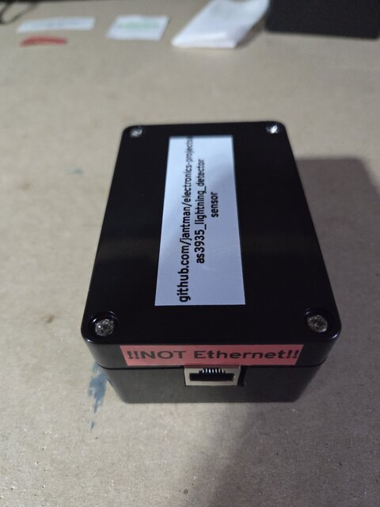

# AS3935 Lightning Detector Node

**Per-strike lightning detection for Home Assistant, built around an AS3935 "Franklin" sensor and
an ESP32 running ESPHome.** Two small boxes joined by an ordinary Cat5 patch cable: the noisy half
— ESP32, WiFi radio, USB supply — in one, and the 500 kHz magnetic antenna as far away from it as
you care to walk.

[](images/complete-node.jpg)

*The whole thing. Sensor box left, main box right, a certified patch cable between them, and the
USB brick on a short mains extension so the USB run stays short.*

---

## Contents

- [What it does](#what-it-does)
- [Does it actually work?](#does-it-actually-work)
- [How it works](#how-it-works)
- [Bill of materials](#bill-of-materials)
- [Building one](#building-one)
- [Firmware and configuration](#firmware-and-configuration)
- [Bring-up](#bring-up)
- [Siting it](#siting-it)
- [The traps that cost the most time](#the-traps-that-cost-the-most-time)
- [Repository contents](#repository-contents)
- [Status and known limitations](#status-and-known-limitations)

---

## What it does

A commercial weather station — an Ecowitt WS90, in this case — will happily tell you *how many*
lightning strikes there were today and how far away the last one was. What it will not give you is
**the individual strikes**, which is the interesting part when a storm is directly overhead.

The insight the project rests on is that the WS90's lightning sensor is an **AMS/ScioSense AS3935**,
and that chip raises a hardware interrupt on *every* event it classifies. The limitation is the
vendor's data exposure, not the sensor. So: run your own AS3935, read its interrupt directly, and
you get per-strike events with an approximate distance, locally, for about $60 in parts.

**What you get per event:** a classification (lightning / disturber / noise floor), an estimated
distance in 14 steps from 1 to 40 km, and a relative energy figure.

**What you do not get:** true distance. Single-station RF ranging is an estimate, not a
measurement. And the AS3935 resolves roughly one event per second, deactivating for ~1.5 s after
each disturber, so no single-chip design catches every stroke of an intense close storm.

---

## Does it actually work?

**Yes — confirmed against three real thunderstorms, 2026-09-19 to 09-22.** This mattered, because
for most of the project's life every "strike" it had ever reported was believed false: bench EMI
classified as lightning, always at 1.0 km, plus an out-of-range code that arrives in Home Assistant
looking like a plausible 63 km strike.

| | Node | WS90 (independent, same house) |
|---|---|---|
| Storm A — 09-19, 16:00–22:00 | 611 events | 197 strikes |
| Storm B — 09-20, 17:00–21:00 | 104 events | 13 strikes |
| Distant activity — 09-21 | 8 events | 5 strikes |
| Storm C — 09-22, 04:00–11:00 | 152 events | 75 strikes |
| **Everything else, 7 days** | **0** | 1–4 per hour, around the clock |

Four things make that read as real lightning rather than more interference:

- **The distances behave like distances.** Fourteen distinct codes appeared — 1, 5, 6, 8, 10, 12,
  14, 17, 20, 24, 27, 31, 34, 37 km — moving inward from 27–37 km as each storm approached,
  collapsing to 5–6 km through the peak, and back out as it left. Bench false lightning was
  1.0 km, every single time.
- **The out-of-range `63` code never appeared.** Not once in seven days. It had dominated every
  earlier dataset.
- **Energies span two orders of magnitude** (~1,500 to ~326,000), with the largest in the peak hours.
- **A separate detector in the same house saw the same storms in the same hours.**

And between storms, nothing at all: **zero false lightning in four days**, against 3–8 per *minute*
on the original breadboard. Getting to that number is most of what the engineering notebook is
about.

(The WS90's steady 1–4 strikes an hour on clear nights is its own affair. Either it has a
false-positive floor this node does not, or an outdoor sensor hears distant strikes an indoor one
misses. Nothing here separates the two, which is worth remembering before treating it as ground
truth.)

The full analysis, including what this does **not** establish — the node counts about three times
what the WS90 counts, and no individual strike has been cross-checked against lightningmaps.org —
is in [notebook §11.9](docs/project-notebook.md).

---

## How it works

```
  MAIN ENCLOSURE                                 SENSOR ENCLOSURE
  ┌────────────────────────────┐                 ┌──────────────────────────┐
  │ USB brick (2-3 A)          │   Cat5 patch    │  RJ45 jack               │
  │   │ short, thick cable     │   0.3 - 3 m     │    │ 5 V                 │
  │   ▼                        │  ┌───────────┐  │    ▼                     │
  │ ESP32 dev board  ──────────┼──┤ RJ45 jack ├──┼─► 100 Ω ─► bulk cap      │
  │   + 5 V bulk cap at pin    │  └───────────┘  │    ▼                     │
  │                            │   5V GND SCLK   │  MCP1700 LDO (3.3 V)     │
  │                            │   MISO MOSI     │    ▼                     │
  │                            │   CS  IRQ  GND  │  1 µF ∥ 100 nF           │
  │                            │                 │    ▼                     │
  │                            │                 │  SEN-39003 (AS3935)      │
  └────────────────────────────┘                 └──────────────────────────┘
     vented                                         sealed, SELV only
```

### Why two boxes

The AS3935 is not a radio receiver. It is a **500 kHz resonant loop antenna** — a near-field
*magnetic* sensor. Near-field coupling falls off as **1/r³**, which means a feeble interferer
30 cm away comfortably beats a powerful one across the room, and it means the single most
effective design lever available is **distance**: 5 cm to 50 cm is roughly a 1000× reduction.

The ESP32 is the obvious thing to get away from. Its WiFi transmit bursts draw 300–500 mA and are
precisely the kind of impulsive load the sensor is built to notice. So the ESP32, its supply and
its bulk capacitor live in one box, the sensor in another, and an ordinary **certified patch
cable** sets the distance — which makes separation a variable you can sweep rather than a guess
you commit to at build time.

### The interconnect

Seven signals down a Cat5 patch cable, wired **T568B at both ends** so any pre-made cable works:

| Pin | T568B colour | Signal | ESP32 pin | Sensor pin |
|---|---|---|---|---|
| 1 | white/orange | **5 V** | `5V` (via C1) | LDO input |
| 2 | orange | GND | `GND` beside GPIO19 | PG |
| 3 | white/green | **SCLK** | GPIO19 | SCLK |
| 6 | green | GND | `GND` beside GPIO19 | PG |
| 4 | blue | MOSI | GPIO18 | MOSI |
| 5 | white/blue | MISO | GPIO5 | MISO |
| 7 | white/brown | CS | GPIO16 | CS |
| 8 | brown | IRQ | GPIO4 | IRQ |
| SH | *(jack shell)* | shield | `GND`, main board only | not connected |

Notes worth having before you wire it:

- **The spare conductor is spent on a second ground paired with SCLK** (pins 3 and 6), so the
  fastest edge on the cable gets its own return path.
- **These are not the default VSPI pins**, deliberately. On the main board each series resistor
  solders pin-to-pin between an ESP32 pin and the jack pin directly below it, and neither pin
  order can move — the jack's is fixed by the cable, the dev board's by the dev board. This is the
  only assignment that lines all three up. The ESP32's GPIO matrix makes it free.
- **68 Ω series terminators on SCLK, MOSI and CS**, at the ESP32 end, fitted from the start.
  Unterminated, the ESP32's ~30 Ω output launches ~2.5 V into a ~100 Ω line; that doubles at the
  AS3935's input, and the ESD clamps dump the excess **into the sensor's local 3.3 V rail** on
  every clock edge. Which is the one rail the entire architecture exists to keep quiet. Only the
  lines the ESP32 *drives* get one — series termination works at the source.
- ⚠️ **This is not Ethernet.** The jack carries 5 V and SPI. Plug it into a live PoE switch port
  and 48 V lands on those lines, destroying both ends. This is a knowing trade for certified
  pre-made cables. **Label both ends** — see the photos.

### Power

**5 V travels down the cable; 3.3 V is made at the sensor**, centimetres from the pins:

```
RJ45 pin 1 (5 V) ──► 100 Ω ──► 47 µF ──► MCP1700-3302E ──► 1 µF ∥ 100 nF ──► sensor VDD
                                                            (100 nF nearest the pin)
```

A **linear** regulator specifically: a switcher would put a 100 kHz–1 MHz noise source centimetres
from a 500 kHz magnetic antenna, which is the worst place in the design for one. At the sensor's
sub-milliamp draw the wasted heat is nothing, and the 100 Ω costs about 0.1 V.

The LDO does not replace the passives. Its power-supply rejection is strong at low frequency and
**gone well before 500 kHz** — it handles the droop and the WiFi sag the cable delivers, and the RC
and the ceramics handle the band the AS3935 actually cares about. Neither alone is sufficient.

⚠️ **The USB cable is a circuit element, not an accessory.** Cheap cables use 28 AWG power
conductors: over 2 m that is ~0.84 Ω there and back, which at a 500 mA WiFi burst drops ~0.42 V and
browns out the dev board's regulator. Use **≤1 m with 20–24 AWG power conductors**, buy on stated
gauge rather than on an amp rating, and **lengthen the mains side, not the USB side** — put the
brick on a short AC extension beside the box.

---

## Bill of materials

Roughly $60 for the node, plus the optional emulator. DigiKey part numbers where it matters.

| Function | Part | Notes |
|---|---|---|
| Sensor | Playing With Fusion **SEN-39003** | Pre-calibrated AS3935 breakout. Ships with its tuning capacitance printed on the label — this is the whole reason to buy the pre-calibrated board. Needs a 0.1″ breakaway header soldered on. |
| MCU | **ESP32-DevKitC V4** (ESP32-WROOM-32D), 38-pin | 19 pins per row, rows 1.0″ apart. **Measure yours** — 0.9″ versions exist. |
| PSU | **2–3 A USB brick** | A 2 W mains module was built first and browned out; see notebook §5. |
| USB cable | **≤1 m, 20–24 AWG power conductors** | Not incidental. |
| Sensor-rail LDO | Microchip **MCP1700-3302E/TO** | 3.3 V, TO-92. **`E` = −40/+125 °C grade**, required for an attic. |
| Interconnect | **Cat5/Cat5e patch cables**, 0.3 / 1 / 2 / 3 m | Pre-made, so length is the only variable between them. |
| Connectors | 2 × **shielded RJ45 jack on a 9-way 0.1″ breakout** | Pins `1 2 3 4 5 6 7 8 SH` silkscreened. The right-angle header solders straight into the perf on both boards. |
| Enclosure ×2 | Non-metallic, ≥45 mm interior height | Main (vented) + sensor (sealed). The RJ45 breakout stands ~30 mm on its header, which is what runs out of room first. |
| Perf board ×2 | 0.1″ **isolated pads** — not stripboard | Sensor board 24 × 18 holes; main board 27 × 17. |
| 5 V bulk cap (C1) | Nichicon **UPW** 470–1000 µF, 16–25 V, **105 °C** | e.g. UPW1C471MPD. Mounts at the ESP32's `5V`/`GND` pins. |
| Sensor-rail bulk cap (C2) | Panasonic **EEU-FR1H470** | 47 µF, 50 V, 105 °C |
| Ceramic 100 nF (C4) | Kemet **C320C104K5R5TA** | X7R, closest to the sensor VDD pin |
| Ceramic 1 µF (C3) | Kemet **C330C105K5R5TA** | X7R. **Not optional** — the MCP1700 needs it for stability. |
| R1 | 100 Ω, ¼ W metal film | Sensor-rail RC filter |
| R2 / R3 / R4 | **68 Ω, ¼ W metal film**, 3 off | Series terminators on SCLK / MOSI / CS |
| Bus wire | **Bare solid tinned copper, 22 AWG**, ~1 m | Sensor board's four buses. Must lie straight across a row of pads. |
| Hookup wire | **Solid core, 24 AWG**, 5 colours, ~2 m | Must enter a 1 mm hole unaided. |
| Female header | 0.1″ 1×40 breakaway, 2 off | Cut to 1×19 to socket the ESP32 |
| Male header | 0.1″ 1×40 breakaway | 8 pins for the SEN-39003 |
| *Optional tester* | Playing With Fusion **SEN-39002** | Lightning emulator shield. Stacks on any spare Arduino Uno R3 — no wiring. |

⚠️ **Gauge is electrically irrelevant on both boards** — the whole sensor rail draws under 1 mA and
the longest run is ~90 mm. Both wire choices above are *mechanical*: a bus has to be a straight
bare bar soldered to a row of pads, and a link has to go into a 0.1″ hole by itself. Stranded
silicone wire is excellent wire for something else. 30 AWG Kynar is too fragile — rigidity is a
pass/fail test in this project, for reasons the notebook explains at length.

**The one place gauge ever mattered is the USB cable, and that is a cable you buy.**

---

## Building one

The printable drawings are the real build instructions; this is the narrative around them.

- **[`as3935-protoboard-layout.pdf`](as3935-protoboard-layout.pdf)** — which hole every part and
  every wire goes in, for both boards, plus build order and traps. Regenerate with
  `python3 make-protoboard-layout.py` (needs `reportlab`).
- **[`as3935-node-wiring.pdf`](as3935-node-wiring.pdf)** — six pages of point-to-point wiring,
  connector and board pinouts, the wire schedule and a bring-up checklist. Regenerate with
  `python3 make-wiring-diagram.py`.

Both read their shared date stamp from `DRAWING-VERSION` and print it in every page footer. The two
documents are only usable together — the wire references in one are the hole coordinates in the
other — so **if two printouts carry different stamps, one of them is stale.**

### 1. The sensor board

| [](images/sensor-board-component-side.jpg) | [](images/sensor-board-solder-side.jpg) |
|:--:|:--:|
| *Component side. RJ45 breakout standing on edge at the left, power chain along the top rows — 100 Ω, bulk cap, TO-92 LDO, the two ceramics — and the SEN-39003 on its header at the right, antenna overhanging the board edge.* | *Solder side. The four bare 22 AWG buses run across the backs of the pads; colour-coded 24 AWG links for everything else — blue SPI, green IRQ, red 5 V, black ground.* |

Everything in this box is SELV: 5 V and SPI, nothing else.

1. **Lay the four buses first**, bare wire across the *back* of the pads rather than threaded
   through, so every hole stays free for a component lead as well.
2. **Two grounds, exactly one tie.** `PG` (power ground) carries the cable's return, the bulk cap
   and the LDO reference; `SG` (sensor ground) carries only the sensor's GND pin, its 100 nF and
   the SI strap. They meet at one wire and nowhere else. Bridge them a second time and you have
   wrapped a ground loop around the LDO and the 100 nF has stopped being local — which is the
   entire reason there is a regulator out here.
3. **C3 references PG, C4 references SG.** C3 belongs to the regulator, C4 to the sensor. Swapping
   them defeats the split as surely as a second tie would.
4. **Check the MCP1700's pinout.** TO-92, flat face toward you, leads down: **GND, VIN, VOUT**.
   That is *not* the 78xx order, and it puts VIN in the middle. Turned around, it puts 5 V on the
   ground pin.
5. **`SI` ties to ground locally** — that is what selects SPI over I²C. It is not carried on the
   cable.
6. **C4 sits one hole from VDD and one from GND.** That tiny loop is the entire point of the part.
7. **Solder the SEN-39003's header straight into the perf — no socket.** Solderless contacts on
   this rail are the prime suspect for the project's worst measurement artefact, and the board is
   calibrated per unit, so it is not something you swap casually anyway.
8. **Keep metal away from the antenna.** The loop overhangs the board edge on purpose. Nylon
   standoffs and nylon screws near it: a steel screw beside a 500 kHz loop is a shorted turn.

### 2. The RJ45 breakouts

[](images/rj45-breakout-on-edge.jpg)

*The breakout's right-angle header solders straight into a run of nine holes, so it stands on edge
with the jack facing off the board edge and out through the enclosure wall.*

This is the connector most likely to be wired mirrored, so:

- **The order you see depends on which way up the header is** — not on which side you look from.
  Header at the top, the pins read `1 2 3 4 5 6 7 8 SH` left to right as printed. Turn it half a
  turn and the same pins read `SH 8 7 6 5 4 3 2 1`. **Wire to the printed number, never to a
  position.**
- **Standing, the breakout blocks the three rows or columns behind its pins** from above. Anything
  that has to go in there goes in *before* the breakout does. On the main board that includes one
  ground hop that becomes unreachable afterwards.
- **The wall takes the plug force, not the nine header joints.** Mount the board with that edge
  against the enclosure wall and the jack through a cutout, or bracket the breakout by its own
  mounting holes.
- **SH is bonded to ground at the main board only**, and left floating at the sensor. With UTP it
  is electrically dead either way; bonding one end means that if a shielded cable is ever fitted by
  accident, its shield is grounded at exactly one end instead of looping the whole run.

### 3. The main board

| [](images/main-board-component-side.jpg) | [](images/main-board-solder-side.jpg) |
|:--:|:--:|
| *ESP32 socketed on female headers, lying lengthwise with its USB end overhanging the board edge. C1 at the `5V` pin; RJ45 breakout standing on edge along the bottom.* | *Solder side. The three blue 68 Ω terminators soldered pin-to-pin between the ESP32 header row and the jack row below it, and the long red 5 V run that goes around the end of the header rather than between its pins.* |

1. **Socket the ESP32** — unlike the sensor. Dev boards die, this one is metres from the antenna,
   and you want BOOT and EN reachable. **Measure its header row spacing first** and use the dev
   board itself as the drilling jig.
2. **Everything between the two headers is soldered pin to pin on the back.** There is no room for
   a resistor footprint between them, which is exactly what forced the GPIO choice above. Four
   parallel runs 2.54 mm apart: insulated wire for the links, short straight leads on the resistors.
3. **Fit the ground hop before the jack.** Those runs wall off the back of the rows behind the
   breakout, so two of the cable grounds cannot reach the ESP32's ground pin from underneath; one
   link hops over on the component side instead, and once the breakout is in it is out of reach.
4. **5 V goes around the end of the header, not between its pins.** Every shorter route squeezes
   between two joints a millimetre apart. At ~1 mA the detour costs nothing.
5. **Three cable grounds, one ESP32 pin.** Cable pins 2, 6 and SH all meet at the GND beside
   GPIO19, so the SCLK pair returns right next to its driver. C1 keeps its own ground pin to itself.
6. **C1 as close to the `5V` pin as the dev board allows.** There are five pins between `5V` and
   its nearest ground: ~27 mm of loop however you arrange it. Keep its two links short.

### 4. Enclosures

| [](images/sensor-board-in-enclosure.jpg) | [](images/main-board-in-enclosure.jpg) |
|:--:|:--:|
| *Sensor board on standoffs, jack through the wall cutout, antenna overhanging into clear space at the far end.* | *Main board, USB cable entering through a grommet, jack through the opposite wall.* |

[](images/sensor-enclosure-closed.jpg)

*Closed and labelled: what it is and where the documentation lives, plus the label that matters —
**!!NOT Ethernet!!** beside the jack, on both boxes.*

- **Both non-metallic.** No metal faceplate, no conductive coating: the loop antenna must not be
  shielded or detuned.
- **Size on interior height.** Each RJ45 breakout stands ~30 mm on its header, so allow **≥45 mm
  inside** plus standoffs and lid clearance, ~5 mm around each board's outline, and ~35–40 mm past
  the dev board's USB end for the plug.
- **Main box vented, sensor box sealed.** Different reasoning for each: the main box has real
  dissipation and an attic peaking at ~52 °C will bake a sealed one. The sensor box dissipates
  essentially nothing.
- **105 °C electrolytics are mandatory** at that ambient. Every ~10 °C over rating roughly halves
  electrolytic life; 85 °C parts die in a couple of summers where 105 °C parts last years.
- **Mechanically rigid.** This is a pass/fail test, not a preference — see the traps below.

### 5. Label both ends

Print two labels. One says what the box is and where its documentation lives. The other says
**!!NOT Ethernet!!** and goes right beside the jack. The jack carries 5 V and SPI, it fits every
switch port in the house, and a PoE port will destroy both ends of the node.

---

## Firmware and configuration

ESPHome's native `as3935_spi` component. The complete configuration is
[`lightning-detector.yaml`](lightning-detector.yaml). The settings that are not obvious:

| Setting | Value | Why |
|---|---|---|
| `spi_mode` | **`MODE1`** | ⚠️ **Mandatory, and its absence is silent.** The component declares Mode 0; the AS3935 is a Mode 1 part. In Mode 0 the ESP32 samples MISO on the edge the sensor changes it, every byte reads back shifted one bit, the interrupt register returns an impossible `2`, and *nothing* is logged or published. |
| `capacitance` | **`9`** | **Not picofarads.** ESPHome takes the raw register value in **8 pF steps**, 0–15. Divide the pF figure printed on your board's label by 8 — this board reads 72 pF, so 9. Entering pF fails validation. |
| `data_rate` | `200kHz` | Defaults to 1 MHz. The traffic is a few single-byte register reads per event, and 200 kHz makes cable reflections a non-issue for *sampling*. |
| `lightning_threshold` | `1` | Report every strike. |
| `indoor` | `true` / `false` | Indoor AFE gain for bench work, `false` for a final outdoor or attic install. |
| `mask_disturber` | `false` | Keep disturbers visible while characterising a site; `true` in production. |
| `tune_antenna` | `false` | Set `true` once to confirm the written capacitance, then back — detection is disabled while it is true. |
| `logger: level` | `VERBOSE` | The level every message this project reads is emitted at. ⚠️ **At VERBOSE and above ESPHome prints the WiFi password in plain text** on every connect. Treat saved raw logs accordingly; `tools/ws-log-bridge.py` redacts it. |

⚠️ **After changing `capacitance:`, remove power from the *sensor*.** A reset of the ESP32 does not
power-cycle the AS3935 — it keeps its registers — and the component's write does `old | new` rather
than replacing the value. Going from 9 to 6 on a warm boot silently gives you 15.

⚠️ **Distance `63` is not a distance.** The component publishes the raw register code straight
through as kilometres, and that register is a lookup table: `1` means overhead and `63` means *out
of range, distance not estimable*. Only 5–40 are real. An out-of-range event therefore lands in
Home Assistant looking like a perfectly plausible distant storm.

Several further defects in the ESPHome component are catalogued in
[notebook §8.2](docs/project-notebook.md), along with which complaints about it turn out **not** to
be live bugs. Practical upshot: every option in this configuration is written to the chip
correctly. If detection misbehaves, tune the sensor rather than patching the component.

---

## Bring-up

In this order — each step exists because skipping it cost a bench session at some point.

1. **Bench-assemble both boxes** and connect them with the shortest patch cable.
2. **Measure 5 V at the ESP32 `5V` pin with the intended brick and cable, during WiFi activity** —
   not at idle. Comfortably above ~4.7 V, or fix the cable before going any further.
3. **Measure 3.3 V at the sensor VDD pin**, at the far end of the cable, after the LDO.
4. **Verify the tuning capacitance over serial.** This is the one check that cannot be done over
   WiFi at any log level: the line is printed from `setup()`, before the API comes up, and ESPHome
   does not replay boot logs to a late-connecting client. Look for `Setting tune cap to 72 pF` —
   your label value. Better still, read the chip's own `TUN_CAP` register back, which is evidence
   rather than an intention.
5. **Fire the emulator** (or click a piezo BBQ igniter 10–30 cm away). Expect **disturbers, not
   lightning** — see the traps below.
6. **Run the platform-validity test** before trusting any measurement: survey an hour, handle the
   build, survey another hour. If the rates move, stop and fix the mechanics.
7. **Only then** mount it.

**A useful failure signature to recognise:** with the sensor unplugged, every register reads `255`
and calibration fails, because MISO idles high with nothing on the bus. That is what "the chip is
not answering" looks like.

**Do not measure on the sensor board during a survey.** Meter leads on it produced ~210
disturbers/min in testing, and zero the moment they came off.

---

## Siting it

Priority order for an AS3935: **low *continuous* EMI**, distance from large metal masses, install
and tuning access, then thermal. **Height is irrelevant** — 500 kHz is not line-of-sight, which is
liberating when choosing a spot.

Two physical facts drive the whole problem:

- **Proximity dominates.** Near-field coupling falls as 1/r³.
- **The chip hunts impulsive broadband transients with energy near 500 kHz.** Continuous
  narrowband emitters far from that frequency are largely irrelevant — a 900 MHz gateway antenna
  and a DTV antenna are *not* interferers, they are only metal masses to clear.

Ranked suspects, in rough order: **switch-mode supplies of every kind** (most switch at
100–500 kHz), **Qi wireless chargers** (third harmonic lands right on 500 kHz), **HVAC with an ECM
or inverter drive** (continuous, and the worst class), **LED drivers**, **class-D amplifiers**
(whose *fundamental* sits in band), **brushed motors**, **TRIAC dimmers**, **relays and
contactors**, **powerline networking**. WiFi access points are a special case: not via their radio,
but very much via their wall-wart supply.

**Rank candidate sites by ambient false-lightning rate, not by disturber rate.** The obvious metric
is the wrong one — false `INT_L` is what actually corrupts the data. Read the two together, though:
each disturber deactivates the chip for ~1.5 s, so cutting the disturber rate hands back listening
time and can make false lightning look *worse*.

`tools/ambient-survey.py` is the instrument for this, and it reads a piped log stream as happily as
a serial port, so a mounted node can be surveyed without touching it:

```bash
tools/ws-log-bridge.py | tools/ambient-survey.py --stdin --minutes 60 --bucket 300
```

⚠️ **A zero means nothing until you have proved the sensor is alive.** A quiet room and a patch
cable knocked loose in the move produce identical output. Fire the emulator while watching the
stream, then believe the zero.

---

## The traps that cost the most time

Every one of these is written up properly in the [engineering notebook](docs/project-notebook.md).

- **`spi_mode: MODE1`.** Silent, total failure without it. Cost a bench session.
- **A breadboard is not a valid test platform for this.** The original build's interference floor
  dropped by two thirds *the moment somebody touched it*, and stayed down across two power cycles.
  Thirteen hours of beautifully stable data before that were stable only because nobody went near
  it. A platform that sensitive to being handled cannot measure anything else — not the location,
  not the supply, not the HVAC. Long separated power jumpers are loop antennas, which is the one
  structure this sensor is built to detect.
- **Run the control before believing an A/B result.** A power-bank hour showed disturbers falling
  63% against a thirteen-hour baseline. It survived a time-of-day check and a per-circuit household
  power check. It was still wrong — restoring the original supply left the rate unchanged. The
  finding had already been written up and had to be retracted. One extra unattended hour was the
  difference.
- **Change one thing at a time.** The first validity test handled the build, lengthened the cable
  and changed the supply in a single power-down. When the rate moved, nothing could be attributed
  to anything.
- **The emulator proves the plumbing, not the physics.** The purpose-built SEN-39002 fires the
  interrupt reliably — 15/15 against 0/5 sham controls — and the AS3935 classifies every burst as a
  **disturber**, never lightning. Amplitude, spike rejection, staircase timing and a line-by-line
  audit of the driver all failed to change it. Meanwhile ambient bench EMI *did* pass the chip's
  lightning model. Use the emulator to prove the interrupt path; budget for a real storm to prove
  anything else.
- **Verify the output path end to end, early.** The per-strike path into Home Assistant has never
  worked, and nothing pointed at it: no error, no dropped connection, every other entity on the
  node updating normally. It was found by checking a metric directly, after 34.7 hours and
  thousands of detections had produced zero recorded state changes.
- **Measure, don't infer.** HVAC state inferred from a duct thermometer gave a confident, wrong
  answer. Whole-house per-circuit power metering settled it — and also cleanly exonerated the attic
  gable fan, which proximity alone made the best suspect.

---

## Repository contents

```
README.md                     this file
lightning-detector.yaml       complete ESPHome configuration
as3935-node-wiring.pdf        printable point-to-point wiring set
as3935-protoboard-layout.pdf  hole-by-hole layout for both boards
make-wiring-diagram.py        regenerates the wiring PDF      (needs reportlab)
make-protoboard-layout.py     regenerates the layout PDF      (needs reportlab)
DRAWING-VERSION               shared date stamp printed in both PDFs' footers
images/                       build photographs (thumbnails in images/thumbs/)
tools/                        measurement instruments — see tools/README.md
  ambient-survey.py             site survey: counts and buckets INT_NH / INT_D / INT_L
  emulator-trial.py             sham-controlled emulator correlation harness
  ws-log-bridge.py              node logs over WiFi via the ESPHome dashboard
sen39002-emulator-uno/        PlatformIO project for the SEN-39002 emulator shield
docs/
  project-notebook.md           the full engineering history — every § reference points here
  strike-pipeline-design.md     the per-strike MQTT pipeline: designed, not built
  sdr-interference-hunting.md   how to hunt a 500 kHz interference source, if it comes to that
```

**[`docs/project-notebook.md`](docs/project-notebook.md) is the interesting document** if you are
building one of these or debugging your own. It is the complete record: the options considered, the
measurements, the two findings that had to be retracted, and the reasoning behind every choice
summarised above.

---

## Status and known limitations

**Working and installed.** The node has been in the garage attic since 2026-09-22, having detected
three real storms from its previous location. WiFi −49 to −55 dBm; ESP32 internal temperature
settling around 50 °C on a September afternoon, which is in line with the attic's ~52 °C summer
peak.

**Known limitations, honestly:**

- ⚠️ **The per-strike path into Home Assistant does not work**, and this is the project's core
  deliverable. The component's Storm Alert pulse is emitted correctly by the device and recorded by
  HA roughly 1% of the time. Distance and energy *do* land, because real strikes vary and Home
  Assistant records changes — which is the only reason the storm detection above could be read at
  all. It is not a per-strike event stream. The diagnosis is complete and the fix is designed in
  [`docs/strike-pipeline-design.md`](docs/strike-pipeline-design.md); it is deliberately deferred,
  not forgotten.
- **No per-event timestamps** outside a live survey, and so no strike-level cross-check against
  lightningmaps.org. Same root cause.
- **The strike *count* is not yet trustworthy.** The node logged about three times the WS90's count
  during the largest storm. Intra-cloud activity, the WS90's own aggregation and storm-correlated
  EMI would all produce that, and nothing here separates them.
- **The attic has no baseline yet.** Five quiet hours since the install, no liveness check run
  there, and no disturber or noise-floor survey — those classes never reach Home Assistant.
- **The configuration is still bench-tuned** (`indoor: true`, `spike_rejection: 1`). It is also the
  configuration that detected three storms, so retuning it is now a change to a working instrument
  rather than a cleanup.
- **The noise floor was never explained.** Characterised on the old platform as bimodal, irregular,
  invisible to whole-house power metering and uncorrelated with temperature — and then the platform
  it was measured on was disqualified. It has not reappeared on the rebuilt hardware.

---

## License

See [LICENSE](../LICENSE) in the repository root.
